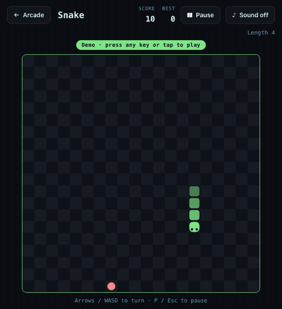
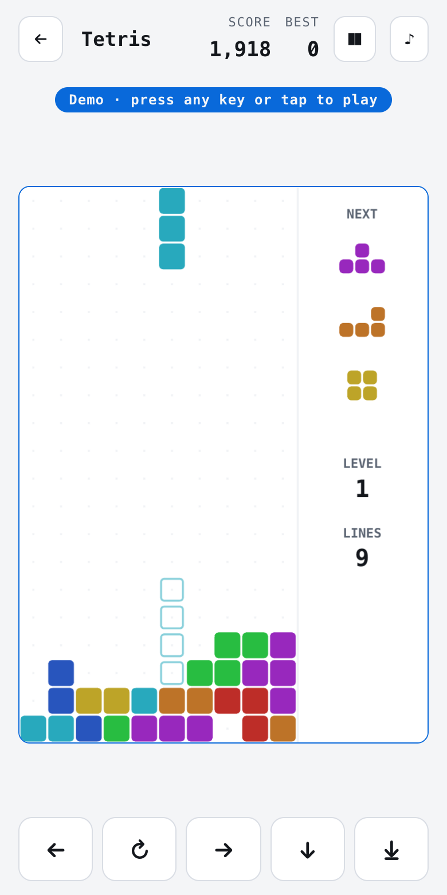
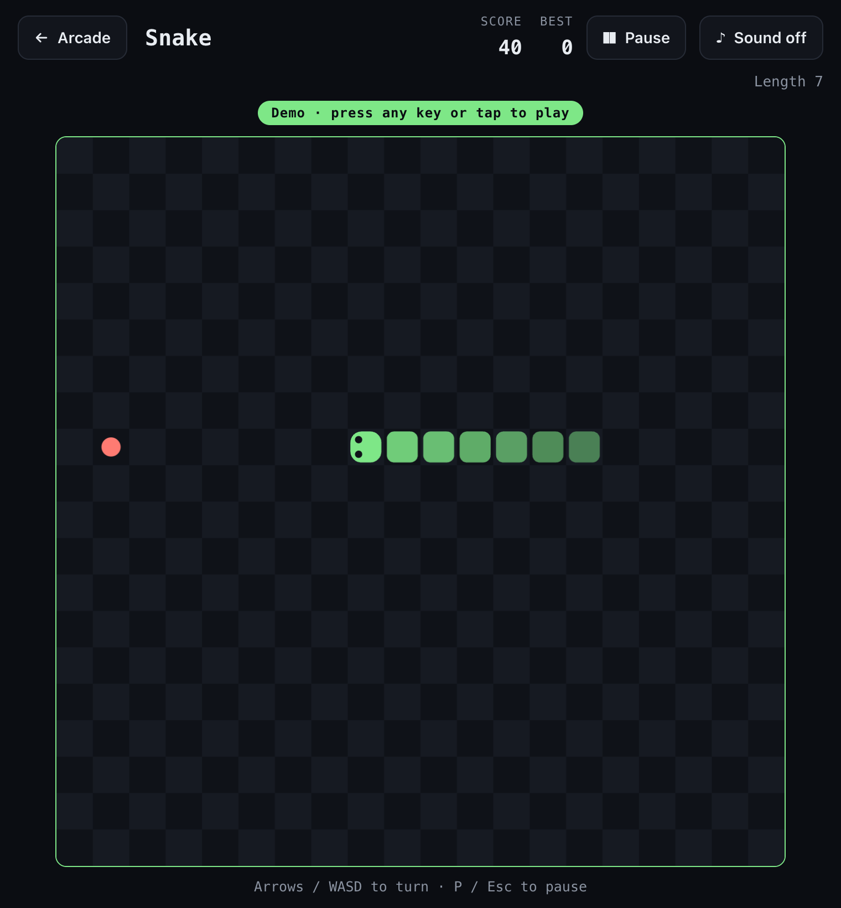
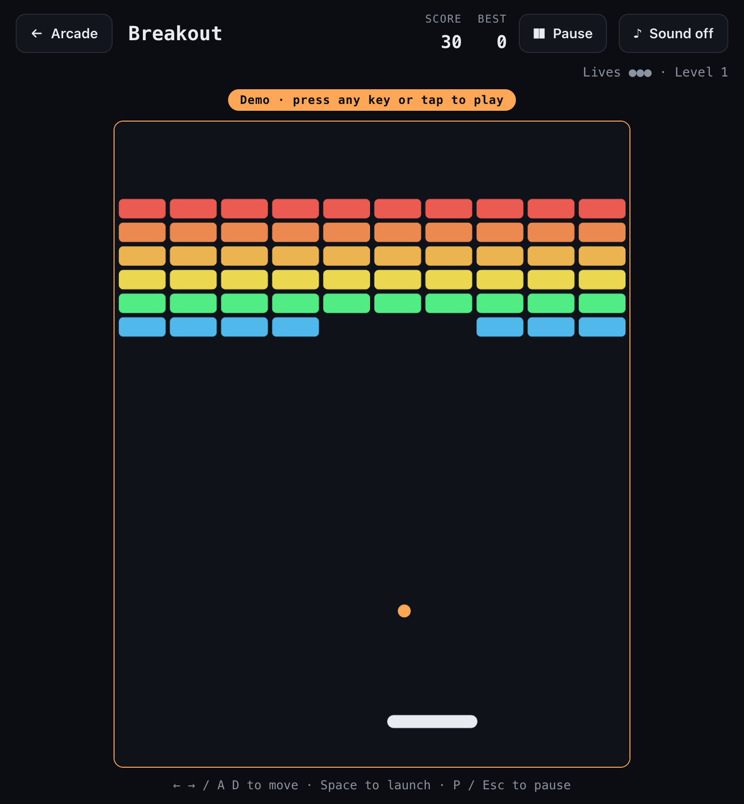
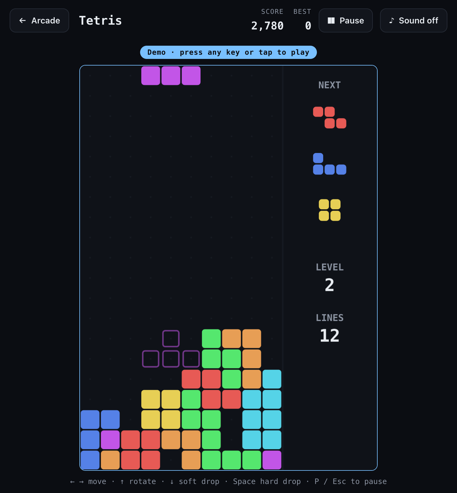
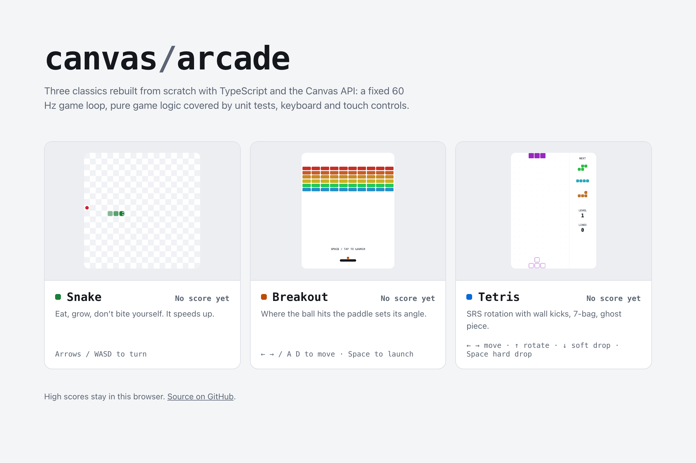

<div align="center">

# canvas/arcade

**Snake, Breakout and Tetris, rebuilt from scratch with TypeScript and the Canvas API.**

No game engine, no UI framework, no runtime dependencies: a fixed-timestep loop, pure game
logic covered by 80 unit tests, keyboard and touch controls, and a demo mode where each game
plays itself.

[](https://github.com/FabianoArthur/atividades3/actions/workflows/ci.yml)
[](LICENSE)

**[▶ Play it in the browser](https://fabianoarthur.github.io/atividades3/)** · [Português](README.pt-BR.md)



</div>

## What's inside

|     | Game         | What makes it more than a toy                                                                                                                                                               |
| --- | ------------ | ------------------------------------------------------------------------------------------------------------------------------------------------------------------------------------------- |
| 🟩  | **Snake**    | Turn buffer (two quick taps inside one tick both count), no 180° suicide, food never spawns on the body, speeds up as you eat, swipe controls on phones.                                    |
| 🟧  | **Breakout** | Circle-vs-box collision resolved along the axis of least penetration, sub-stepped movement so a fast ball can't tunnel through a brick, bounce angle set by where the ball hits the paddle. |
| 🟦  | **Tetris**   | Guideline-style: SRS rotation with the real wall-kick tables, 7-bag randomiser, ghost piece, lock delay with move resets, DAS/ARR auto-repeat, guideline scoring and gravity curve.         |

Plus: local top-5 high scores, optional synthesised sound effects (WebAudio, muted by
default, no audio files), pause on blur, light and dark themes that follow the system setting, `prefers-reduced-motion`
support, and a phone layout with on-screen controls.

<p align="center"><br><sub>On a phone: on-screen controls, light theme.</sub></p>

<table>
  <tr>
    <td></td>
    <td></td>
    <td></td>
  </tr>
</table>

<picture>
  <source media="(prefers-color-scheme: dark)" srcset="docs/assets/menu-dark.png">
  
</picture>

## Run it

```bash
git clone https://github.com/FabianoArthur/atividades3.git canvas-arcade
cd canvas-arcade
npm ci
npm run dev          # http://localhost:5173
```

| Command                              | What it does                                                     |
| ------------------------------------ | ---------------------------------------------------------------- |
| `npm run dev`                        | Vite dev server with hot reload                                  |
| `npm test`                           | Vitest, 80 tests of the game logic and engine                    |
| `npm run lint` / `npm run typecheck` | ESLint (typescript-eslint strict, type-checked) / `tsc --noEmit` |
| `npm run build`                      | Type-check and build the static site into `dist/`                |

Routes are hash-based so they work on GitHub Pages: `#/snake`, `#/breakout`, `#/tetris`, and
`#/<game>/demo` for demo mode.

### Controls

|          | Keyboard                                            | Touch                            |
| -------- | --------------------------------------------------- | -------------------------------- |
| Snake    | Arrows / WASD                                       | Swipe on the board, or the d-pad |
| Breakout | ← → / A D, Space to launch · or just move the mouse | Drag on the board, tap to launch |
| Tetris   | ← → move · ↑ rotate · ↓ soft drop · Space hard drop | Buttons under the board          |
| All      | P / Esc pause                                       | Pause button                     |

## How it works

<picture>
  <source media="(prefers-color-scheme: dark)" srcset="docs/assets/architecture-dark.svg">
  
</picture>

- **Fixed timestep.** [`FixedStepper`](src/engine/loop.ts) accumulates real elapsed time and
  runs logic in exact 1/60 s steps, so a 144 Hz monitor doesn't make the snake faster and a
  backgrounded tab doesn't fast-forward (frame time is clamped).
- **Input is consumed per step, not per frame.** [`InputBuffer`](src/engine/input.ts)
  queues presses between steps and hands each one over exactly once: a tap released before
  the next step still counts, OS key-repeat is ignored, and press order is kept.
- **Pure, deterministic logic.** Each game is `create(rng)` + `update(state, input, rng)` +
  `render(ctx, state)`. Logic never touches the DOM or the clock, and randomness comes from a
  seedable PRNG, so tests reproduce exact situations (a wall kick against the right wall, a
  tetris, a ball at max speed against a 4 px brick).
- **Demo mode is the same code path.** The [autopilots](src/games/tetris/autopilot.ts)
  produce the same `InputFrame` a player would. Snake uses BFS plus a flood-fill safety check,
  Breakout predicts where the ball lands, and Tetris scores every placement by height, holes
  and bumpiness. The README screenshots and GIF are captured from it by
  [`scripts/capture.mjs`](scripts/capture.mjs).
- **Storage that can't crash the game.** [`ScoreStore`](src/engine/storage.ts) wraps every
  `localStorage` access in `try/catch`, validates what it reads, and falls back to memory
  (private mode, blocked storage, corrupted JSON).

```
src/
  engine/      loop, input, rng, storage, audio (no game knowledge)
  games/       snake | breakout | tetris: logic.ts (pure), render.ts, autopilot.ts
  ui/          menu, play screen, overlays, palette
tests/         Vitest specs for engine + every game's logic and autopilot
scripts/       capture.mjs (screenshots/GIF), diagram.py (the animated SVG above)
```

## Tests

```
tests/engine/input.test.ts      10    tests/games/snake.test.ts      12
tests/engine/loop.test.ts        6    tests/games/breakout.test.ts   15
tests/engine/rng.test.ts         5    tests/games/tetris.test.ts     18
tests/engine/storage.test.ts    11    tests/games/autopilot.test.ts   3
```

CI runs formatting, lint, type-check, tests and build on every push and pull request, plus a
[gitleaks](https://github.com/gitleaks/gitleaks) scan of the full history. Actions are pinned
by commit SHA with read-only permissions; only the Pages deploy job can write.

## History

This repository started as a set of beginner exercise prompts (conditionals in JavaScript)
from a coding course. They were never solved here and weren't original work, so they were
replaced by this project; they remain in the git history.

## License

[MIT](LICENSE) © 2026 Fabiano Arthur
